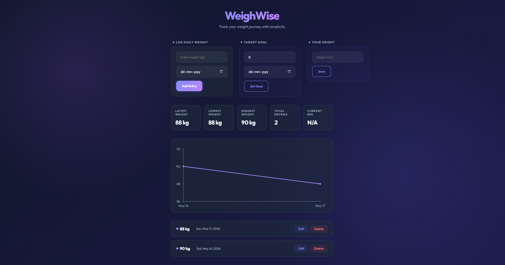

<div align="center">
  <h1>⚖️ WeighWise</h1>
  <p><strong>Track your weight journey with simplicity.</strong></p>
</div>

<br />

A beautiful, responsive, and intuitive weight tracking web application built with React. Set your goals, log your daily progress, and visualize your journey through clean, interactive charts without any unnecessary clutter.

## ✨ Features

- **💎 Premium Glassmorphism Design:** A stunning, vibrant user interface featuring animated gradient backgrounds, frosted-glass effects, and dynamic micro-animations.
- **📊 Interactive Charting:** Visualize your progress over time with a beautiful, fully responsive line chart powered by Recharts.
- **🎯 Goal Tracking & BMI Calculator:** Set a target weight and deadline. Enter your height to instantly calculate and track your Body Mass Index (BMI).
- **✏️ Seamless Data Management:** Log your daily weight and **edit existing entries** on the fly. Accidental clicks are prevented by a sleek **Delete Confirmation Modal**.
- **🍞 Toast Notifications:** Enjoy smooth, modern popup notifications for success and error states using `react-hot-toast`.
- **💾 Local Persistence:** All your entries, goals, and personal data are safely stored locally in your browser using `localStorage`. Your data is available immediately upon your next visit.
- **📱 Fully Responsive:** Carefully crafted CSS ensures the application looks and works perfectly on desktops, tablets, and smartphones.
- **🌗 Dark Mode Ready:** Automatically adapts to your operating system's color preferences for a sleek, premium look—day or night.
- **⚡ Fast & Lightweight:** Built using React and Vite with minimal dependencies for a lightning-fast user experience.

## 🛠️ Tech Stack

- **Core Framework:** [React](https://react.dev/)
- **Build Tool:** [Vite](https://vitejs.dev/)
- **Styling:** Vanilla CSS (Glassmorphism & animated gradients)
- **Data Visualization:** [Recharts](https://recharts.org/)
- **Notifications:** [React Hot Toast](https://react-hot-toast.com/)

## 🚀 Getting Started

Follow these simple instructions to get a copy of the project up and running on your local machine.

### Prerequisites

Ensure you have [Node.js](https://nodejs.org/) installed on your machine.

### Installation

1. Clone the repository:
   ```bash
   git clone https://github.com/Parth424-blip/WeighWise.git
   ```

2. Navigate into the project directory:
   ```bash
   cd WeighWise
   ```

3. Install the dependencies:
   ```bash
   npm install
   ```

4. Start the development server:
   ```bash
   npm run dev
   ```

5. Open your browser and visit the local URL provided by Vite (usually `http://localhost:5173`).

## 🎨 Screenshots



*(Feel free to add more screenshots here!)*

## 🤝 Contributing

Contributions, issues, and feature requests are always welcome! Feel free to check out the [issues page](https://github.com/Parth424-blip/WeighWise/issues) if you want to contribute.

## 📝 License

This project is completely open-source. Feel free to use and modify the code as you see fit!
